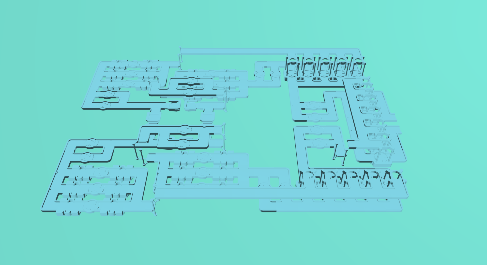

# Shapez 2 Blueprint Renderer
The purpose of this project is to render blueprints from the [Shapez 2] game into a 3D scene.

## Example Render
<Details>
<summary><b>Blueprint Input</b></summary>
> SHAPEZ2-1-H4sIAL38RmQA/6ybTW/TQBCG/8ues5L3y3FybFoEUhAQSgEhDlbrlIgoqYyrIlX974TEgUTrtWd33gsX2kczs7OzM6+nz+JGTFWWuZG4eC+mz+Jq09Sr6peYfnsWX8RUj8RXMZW7/56LaTYSi/2/12Iq5qtloz49zKtl82bTVPWmXN+U9arcNGIkZrsfEC+jPUIFEW+r+r6q9fVWLfoRmY8wB8RFtW4uq2X5uG4Wq/sfA6ZI44N0EkhRLBqOTeuY4dqjgpyPD+tVs/tVdb3VA1HWFGNebeunsr6jhcf4Zx4VHqmDnFO/5rRT77eG5Fjrl/WPfbFtymZbv9tUHx7Lu9nsM+ng+SBJNYkWaSampeTMc1dBTMSxZwiIhJgiNYRifIqJvuXnFMWogToIijFHISgZAgKxpCMoJv6kbbBi/X8z5xRD7IkdKv1l6cBEGqJPCFm6Ido3JCKuB1OMz4gsuib4UpJbGuPX29jAdjQziYicgXCkokSDOATEIiAGAdE+JDasivmSmqAlcbfP+ObEPz0OURvPUkUhUkUhUkUhUkUFDojUm55lDICUoUAwi2BBMihQR61p52ISxPq3M0t6kGywWqSBbMcg2ZS3P6u6jRGJ4iCUHEIxPIo5uRIdBd3sCjql9ci4ddgSMMOvgvWSN/1tsayZRoeuUXTL7fwGc38VL7dPG+rE6Xq7ZSqF31+qk7rZVVwudolLLVGO0YRYj5AltbkOk/aarZYYEEdDOR0HPXv8m/yvy/WS4hADYLmA05mK4YLhusAAHC7KhFkObYgSUQ4NgKFDDPK1Vx4hpRge7Bj3RpU89499YyJCcmAUPiPpuvI5B3vy3gBH6NG9CgBpJhuzK5kFcQyUk3OrSs6tKjm3MBZcFwquCwyAtASZa0FjOAAj5zBykkhFpFgIxUAoOYTSq3YtSN8SemVm2ncNy2zhpfGkBp3+5XJArqa5xJ8nJEr4lpY7B0tLUhKHPpA4zDh9zF3FXgiwFKGVkDcd0rFOOyoXdC2WZCCiw3m1Ucxq4yAUC6EYCAWgbp6nMwKVwUg4m3CBMjASUwiWLrwgEKFSShfctUrBWAzGQDAWVKIta0dKGopgSVvkcH6P8U+xpO9fOO4XfqkhaqNEaWsSJfZJhwUp9hzEIbCVPum4OplkK22SLfa19dZxhg1fGNeRCpm0BF2b0BKhVBOJknHa8MJAOTtfc3a+8gkTxJsxYWwLSU2QZOkL0OPet5Q83Q6IsjSfACqoNCBdVqIE3jb7J+yexSHyTw+rxHOSPwX7NvO1RAZBhfoBehz0MGIRocWcIa5+N3V5u8syWlusQq9YHEd5Da1KwWShT8Up1qCCo7nBkRoZHc2NznFZumCkcEZA0BalC0YDpYNWJP2BSMFYUTguxBdcMbG1paN3ihl3FYSSQSgSY4zEROZ4UExMByWlB3JBY9IxirnR1eVUykEBRiPJ/vB/FDPHKJG/P8b0bqzLNVqUv7+8/BFAgAEAl1BxwnE5AAA=$

</Details>

```shell
shapez2_blueprint_renderer -o out.png blueprint.txt
```



## Compiling and Running
As this project is written in the [Rust Programming Language], you will need to have it build tools installed.

### Desktop Machines
After installing Rust, you can build the project by running `cargo build --release` in the project root directory. The 
executable will then be available at `target/release/shapez2_blueprint_renderer`
(or `target/release/shapez2_blueprint_renderer.exe` for Windows users).

### Headless Linux Environments
To run this project in a headless linux environment, a bit more work is needed. For graphics to function correctly, you
will need to install libraries for windowing and 3D rendering. This can be done using:
```shell
sudo apt-get update
sudo apt-get install libxi-dev libglu1-mesa-dev libglew-dev xvfb xorg openbox libfontconfig1-dev
```
Once the necessary dependencies are installed, you can build the project as you would normally.
```shell
cargo build --release
```
Then to run the project, we also need to provide it with a display to render to. This can be done using `xvfb-run`. It
is important that you replace `WIDTH` and `HEIGHT` with the output width and height of the image, multiplied by the
requested SSAA (defaults to 1). If the screen size is smaller than required, the application will run much slower.
```shell
# target/release is the output directory of the when building with cargo build --release
xvfb-run -s "-ac -screen 0 WIDTHxHEIGHTx24" target/release/shapez2_blueprint_renderer <arguments...>
```

## CLI Arguments
```
Usage: shapez2_blueprint_renderer [OPTIONS] [INPUT_FILE]

Arguments:
  [INPUT_FILE]
          The file which to read the blueprint from. If an input file is not provided, the blueprint will instead be read from stdin

Options:
  -m, --model-dir <MODEL_DIR>
          The directory holding the .obj files representing the various buildings and features within the game

          [default: ./models]

  -o, --out-file <OUT_FILE>
          The path that the output image will be written to. The image type is detected from the path extension. If an output file is not provided, the image will instead be written to stdout as a PNG

  -v, --verbose...
          More output per occurrence

  -q, --quiet...
          Less output per occurrence

      --width <WIDTH>
          The width of the output image

          [default: 1980]

      --height <HEIGHT>
          The height of the output image

          [default: 1080]

      --ssaa <SSAA>
          This argument triggers SSAA on the rendered image. This is provided to allow for anti-aliasing on systems which do not normally support MSAA. Values over 16 will not increase the output quality.

          Note: This is applied by increasing the render size and resampling the output. As such, this is NOT hardware accelerated and is performed on top of any MSAA capabilities the system has.

          [default: 1]

      --ssaa-sampler <SSAA_SAMPLER>
          The sampler used when resizing a super sampled image to the intended size. This will effect the final image quality when resizing is required

          [default: linear]

          Possible values:
          - nearest:  Nearest neighbor sampling (fastest)
          - linear:   Triangle (linear) sampling (~13x slower than nearest sampling)
          - cubic:    Catmull Rom (cubic) sampling (~26x slower than nearest sampling)
          - gaussian: Gaussian sampling (~38x slower than nearest sampling)
          - lanczos3: Lanczos Window 3 sampling (best quality, ~38x slower than nearest sampling)

  -h, --help
          Print help (see a summary with '-h')

  -V, --version
          Print version
```

## License
Files within the [models] directory are the exclusive property of [Tobspr Games] and are licensed under
[CC BY-NC-ND 3.0](models/LICENSE.txt).

All other project files are licensed under MIT.

[Shapez 2]: https://store.steampowered.com/app/2162800/shapez_2/
[Rust Programming Language]: https://www.rust-lang.org/tools/install
[Tobspr Games]: https://tobspr.io/
